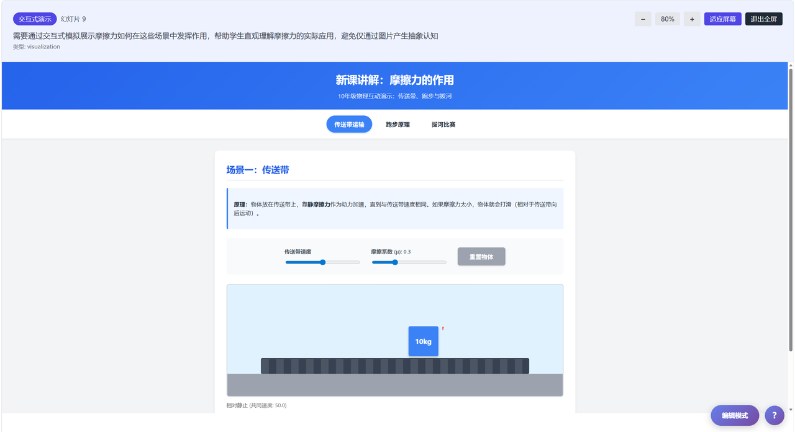
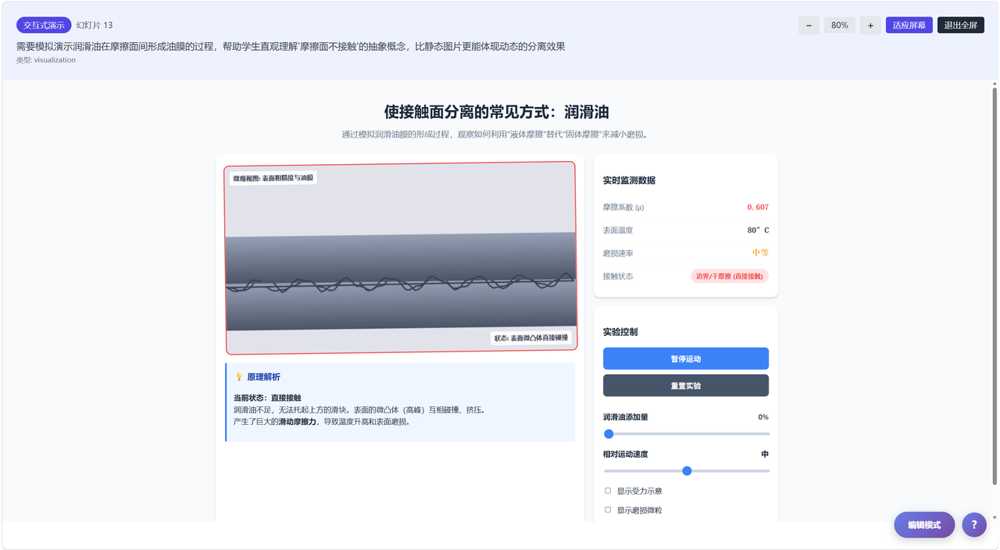
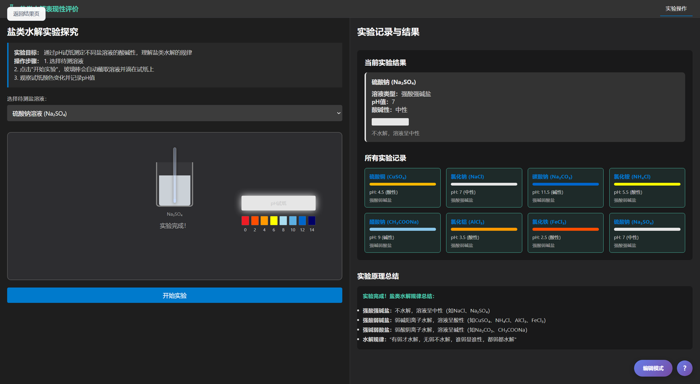
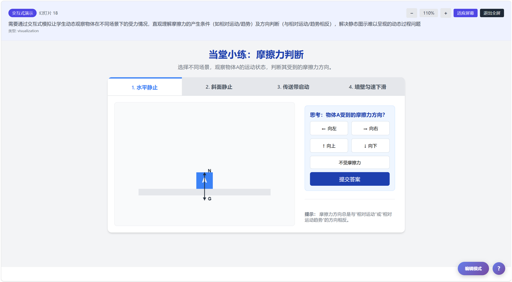

# 🤔Why MAIC-UI?

- Turn abstract knowledge into interactive experiences
- Reduce the cost of creating teaching resources
- Support real classroom use with stable generated results
- Help students learn by exploring, not just watching

# 📖 Introduction

**Let knowledge grow into interfaces, and let interaction flow into thinking.**

MAIC-UI is an **AI-powered interactive teaching generation system** designed for educational scenarios across all grade levels. Centered on generative AI and interactive interface generation, it helps teachers quickly build teaching resources for classroom instruction, self-directed learning, experiment demonstrations, and knowledge exploration.


Unlike traditional static courseware or one-way content generation tools, MAIC-UI focuses not only on **content generation**, but also on **learning process generation**. It aims to transform abstract knowledge into visual, operable, and feedback-driven interactive pages, so that students do not merely *see* knowledge, but can also *manipulate*, *experience*, and *understand* it.

## 💡 Key Highlights

- **AI-driven generation** — Create teaching pages and interactive content from topic inputs.
- **From content to interaction** — Generate not only content, but also interactive learning interfaces.
- **Versatile teaching support** — Suitable for explanations, demonstrations, simulations, and review activities.
- **Process-oriented learning** — Strengthen engagement through guidance, interaction, and feedback.
- **Classroom-ready design** — Built for stable, controllable, and effective classroom use.

## 📍 Positioning

MAIC-UI aims to address more than just the efficiency problem of courseware production. More importantly, it responds to several core needs in educational scenarios:

- How can abstract knowledge become more intuitive?  
- How can classroom presentation turn into student participation?  
- How can AI go beyond assisting content writing to supporting learning experience design?  

Therefore, MAIC-UI is not merely a traditional content generator, but rather:

**An AI interactive teaching interface generation system designed for classroom and learning scenarios.**

# 🚀 Quick Start

## Prerequisites

- Docker & Docker Compose
- Git

## 1. Clone the Repository

```bash
git clone https://github.com/your-username/maic-ui.git
cd maic-ui
```

## 2. Configure Environment

```bash
# Copy the example environment file
cp .env.example .env

# Edit .env and add your API keys
# Required: AI_PROVIDER and corresponding API key (zhipu, anthropic, openai, etc.)
vim .env
```

**Key Environment Variables:**

| Variable | Description | Required |
|----------|-------------|----------|
| `AI_PROVIDER` | AI provider to use (`zhipu`, `anthropic`, `openai`, etc.) | Yes |
| `ZHIPU_API_KEY` / `ANTHROPIC_API_KEY` / `OPENAI_API_KEY` | API key for your chosen provider | Yes |
| `SECRET_KEY` | Secret key for JWT authentication | Yes |
| `DATABASE_URL` | Database connection string (SQLite by default) | No |

## 3. Deploy with Docker Compose

```bash
# Build and start all services
docker compose build
docker compose up -d

# Or build and start in one command
docker compose up -d --build
```

The application will be available at **http://localhost:8927**

## 4. Verify Deployment

```bash
# Check container status
docker compose ps

# Check backend health
curl http://localhost:8927/health
```

## Service Architecture

| Service | Port | Description |
|---------|------|-------------|
| nginx | 8927 | Reverse proxy (public entry point) |
| frontend | 3000 | Next.js application |
| backend | 8000 | FastAPI application |

---

## Development Mode (Optional)

For local development without Docker:

```bash
# Install dependencies
npm run install:all

# Start both frontend and backend
npm run dev

# Or start separately
npm run dev:frontend  # Frontend on port 3000
npm run dev:backend   # Backend on port 8000
```

# ✨ Features

## ✏️ Use Cases

MAIC-UI can be applied to the following typical teaching scenarios:

<table>
<tr>
<td width="50%" valign="top">

**🎯 Lesson Introduction**

Attract students’ attention and stimulate interest through intuitive pages.



</td>
<td width="50%" valign="top">

**📚 Knowledge Explanation**

Transform abstract concepts into visual and interactive content.



</td>
</tr>
<tr>
<td width="50%" valign="top">

**🔬 Experiment Simulation**

Demonstrate processes when laboratory equipment or conditions are limited.



</td>
<td width="50%" valign="top">

**📝 After-class Consolidation**

Strengthen understanding and transfer of knowledge through interactive exercises.



</td>
</tr>
</table>

## 🌟 Advantages

| Dimension                     | Traditional Courseware / Resource Production           | **MAIC-UI**                                               |
| :---------------------------- | :----------------------------------------------------- | :-------------------------------------------------------- |
| Production threshold          | High, relies on manual design and technical operations | Lower, can generate quickly                               |
| Content form                  | Mainly static presentation                             | Dynamic and interactive presentation                      |
| Student role                  | Passive viewer                                         | Active participant and explorer                           |
| Abstract knowledge expression | Difficult to present complex processes                 | Better suited for expressing dynamic patterns             |
| Teaching adaptability         | High adjustment cost                                   | More suitable for quickly generating for different topics |
| Classroom performance         | Strong in presentation, weak in interaction            | Balances both presentation and interaction                |

# 🤝 Contributing

We welcome contributions from the community. Whether it is a bug report, feature suggestion, or pull request, we truly appreciate it.

**Contribution Process**

## 🧩 Project Structure

```Bash
MAIC-UI/
├── frontend/                # Frontend project
│   ├── public/              # Static assets
│   ├── src/
│   │   ├── app/             # Page routes
│   │   ├── components/      # Shared components
│   │   ├── styles/          # Style files
│   │   └── utils/           # Utility functions
│   └── package.json
│
├── backend/                 # Backend project
│   ├── src/
│   │   ├── api/             # API layer
│   │   ├── service/         # Business logic
│   │   ├── models/          # Data models
│   │   └── core/            # Configuration and core functions
│   ├── requirements.txt
│   └── main.py
│
├── docs/                    # Documentation
├── screenshots/             # Project screenshots
├── docker-compose.yml
└── README.md
```

## 🏗️ Core Architecture

MAIC-UI adopts a **frontend-backend separated architecture**, consisting of the following main parts:

- **Frontend layer**: responsible for user interaction, page presentation, and teaching resource display 
- **Backend layer**: responsible for business logic processing, API management, and generation workflow scheduling 
- **AI generation layer**: responsible for teaching content generation, page organization, and interactive resource construction 
- **Data layer**: responsible for user information, resource configuration, and generated result management 

The system operates around the following workflow:

**Input teaching requirements → Generate teaching content → Build interactive pages → Display teaching resources**

## 🔧How to Contribute

# 💼 Business Cooperation

If you would like to apply MAIC-UI to educational products, learning platforms, course resource development, or school-enterprise cooperation scenarios, feel free to contact us for further collaboration.

- **Project Email**: tsq25@mails.tsinghua.edu.cn

## 📝 Citation

If MAIC-UI is helpful to your research or project, please consider citing this project.


```bibtex
@Article{JCST-2509-16000,
  title = {From MOOC to MAIC: Reimagine Online Teaching and Learning through LLM-driven Agents},
  journal = {Journal of Computer Science and Technology},
  volume = {},
  number = {},
  pages = {},
  year = {2026},
  issn = {1000-9000(Print) /1860-4749(Online)},
  doi = {10.1007/s11390-025-6000-0},
  url = {https://jcst.ict.ac.cn/en/article/doi/10.1007/s11390-025-6000-0},
  author = {Ji-Fan Yu and Daniel Zhang-Li and Zhe-Yuan Zhang and Yu-Cheng Wang and Hao-Xuan Li and Joy Jia Yin Lim and Zhan-Xin Hao and Shang-Qing Tu and Lu Zhang and Xu-Sheng Dai and Jian-Xiao Jiang and Shen Yang and Fei Qin and Ze-Kun Li and Xin Cong and Bin Xu and Lei Hou and Man-Li Li and Juan-Zi Li and Hui-Qin Liu and Yu Zhang and Zhi-Yuan Liu and Mao-Song Sun}
}
```

## ⭐ Star History

If this project helps you, please consider giving it a star to support us.

[](https://star-history.com/#THU-MAIC/MAIC-UI&Date)